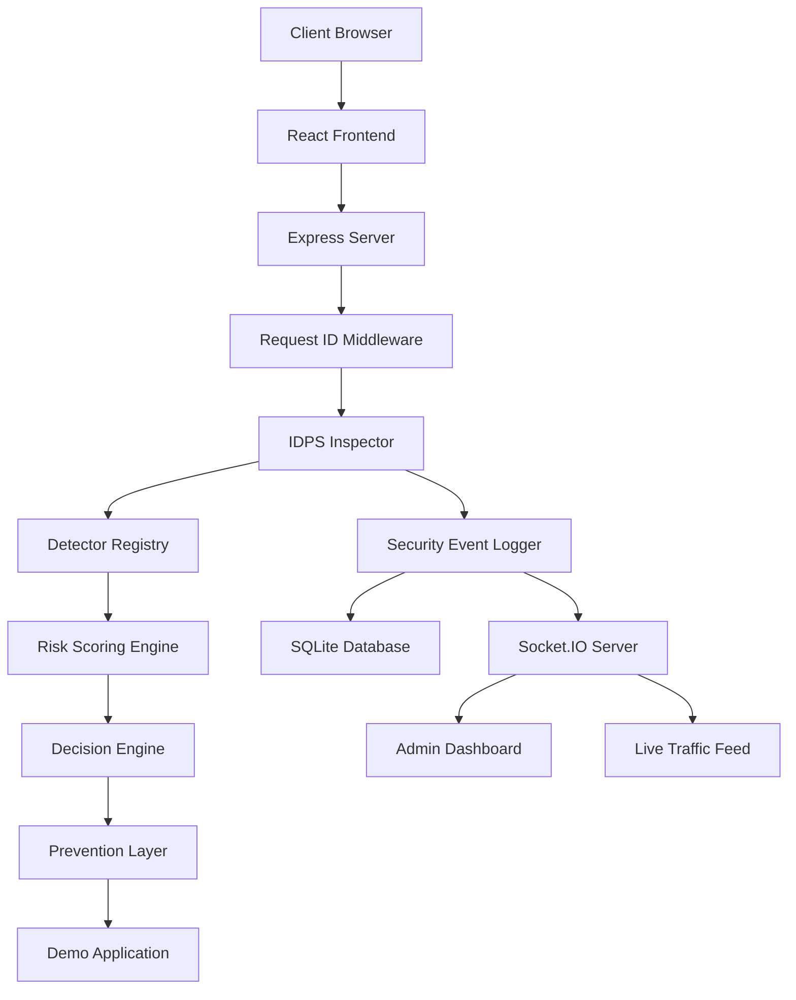

# WebShield Architecture Documentation

## System Overview

WebShield is a full-stack Intrusion Detection and Prevention System (IDPS) that provides real-time web traffic monitoring, threat detection, and automated prevention capabilities.

## Technology Stack

### Frontend
- **React 18**: Component-based UI framework
- **Vite**: Fast build tool and development server
- **Tailwind CSS**: Utility-first CSS framework
- **React Router**: Client-side routing
- **Axios**: Promise-based HTTP client
- **Recharts**: Declarative charting library
- **Lucide React**: Icon library
- **Socket.IO Client**: Real-time bidirectional communication

### Backend
- **Node.js**: JavaScript runtime
- **Express.js**: Web application framework
- **Socket.IO**: Real-time event-based communication
- **Prisma ORM**: Type-safe database ORM
- **SQLite**: File-based SQL database
- **bcrypt**: Password hashing library
- **JWT (jsonwebtoken)**: Token-based authentication
- **Zod**: Schema validation
- **Helmet**: Security HTTP headers
- **CORS**: Cross-origin resource sharing

## Architecture Diagram



## Component Architecture

### Frontend Components

#### Context Providers
- **AuthProvider**: Manages user authentication state
- **SocketProvider**: Manages Socket.IO connection

#### Layouts
- **AdminLayout**: Admin dashboard layout with sidebar
- **DemoLayout**: Demo application layout with sidebar

#### Pages (Admin)
- **Dashboard**: Overview statistics and quick actions
- **LiveTraffic**: Real-time traffic monitoring
- **ThreatEvents**: Security event history with filtering
- **BlockedSources**: Manage blocked IP addresses
- **SecurityRules**: Enable/disable detection rules
- **Analytics**: Visual security analytics
- **TestLab**: Security testing suite
- **SystemLogs**: Server and security logs
- **NetworkDemo**: Multi-computer setup information
- **Settings**: System configuration

#### Pages (Demo)
- **Login**: User authentication
- **Dashboard**: Demo application overview
- **Profile**: User profile page
- **Search**: Search functionality
- **Contact**: Contact form

### Backend Components

#### Middleware
- **IDPS Middleware**: Request inspection and threat detection
- **Auth Middleware**: JWT authentication and authorization
- **CORS**: Cross-origin resource sharing
- **Helmet**: Security headers
- **Cookie Parser**: Cookie parsing

#### Controllers
- **AuthController**: User authentication (login, register, logout)
- **DemoController**: Demo application endpoints
- **AdminController**: Admin dashboard endpoints
- **TestLabController**: Security testing endpoints

#### IDPS Components

##### Detectors
Each detector implements a standard interface:
```javascript
{
  matched: boolean,
  category: string,
  severity: string,
  score: number,
  description: string
}
```

**Detectors Implemented**:
1. **SQL Injection Detector**: Pattern-based SQLi detection
2. **XSS Detector**: Cross-site scripting pattern detection
3. **Path Traversal Detector**: Directory traversal detection
4. **Login Abuse Detector**: Repeated authentication failure detection
5. **Request Rate Detector**: Excessive request frequency detection
6. **Suspicious User-Agent Detector**: Anomalous user-agent detection
7. **Auth Abuse Detector**: Authentication abuse detection
8. **Payload Size Detector**: Oversized payload detection

##### Risk Scoring Engine
- Combines multiple detection results
- Calculates total risk score (0-100)
- Determines severity level (LOW, MEDIUM, HIGH, CRITICAL)
- Caps maximum score at 100

##### Decision Engine
- Implements IDPS modes (MONITOR, IDS, IPS)
- Maps risk scores to actions (ALLOW, LOG, ALERT, RATE_LIMIT, TEMP_BLOCK, BLOCK)
- Considers blocked source status
- Provides policy-based decision making

##### Prevention Layer
- **Rate Limiting**: Configurable request rate limits
- **Temporary Blocking**: Time-based IP blocking
- **Permanent Blocking**: Manual IP blocking
- **Block Management**: Database-backed block storage

#### Database Models

**User**: Application users
- id, email, password (hashed), name, role, timestamps

**SecurityEvent**: Security threat events
- id, requestId, timestamp, sourceIp, method, path, attackType, severity, riskScore, action, description, userAgent, blocked

**BlockedSource**: Blocked IP addresses
- id, sourceIp, reason, blockedAt, expiresAt, active

**SecurityRule**: Detection rules
- id, name, category, enabled, severity, score, description

**SystemSetting**: Configuration settings
- id, key, value

**TrafficEvent**: All traffic logs
- id, requestId, timestamp, sourceIp, method, path, query, body, userAgent, status, riskScore, action

**TestRun**: Security test runs
- id, startedAt, completedAt, totalTests, passed, failed, TP, TN, FP, FN, accuracy, precision, recall, f1Score

**TestResult**: Individual test results
- id, testRunId, testName, expectedType, expectedAction, actualType, actualAction, riskScore, passed

**DeviceLabel**: IP address labels
- id, sourceIp, label

## Data Flow

### Request Processing Flow

1. **Client Request**: Browser sends HTTP request
2. **Express Server**: Receives request
3. **Request ID**: Generate unique request ID
4. **IP Extraction**: Extract and normalize client IP
5. **IDPS Inspection**: Run all detectors
6. **Risk Calculation**: Calculate risk score
7. **Decision**: Determine action based on mode and risk
8. **Prevention**: Apply prevention if needed
9. **Logging**: Log security event and traffic
10. **Socket.IO**: Emit real-time update
11. **Response**: Return response to client

### Socket.IO Events

**Server → Client**:
- `traffic:new`: New traffic event
- `security:new`: New security event
- `security:blocked`: Source blocked
- `security:unblocked`: Source unblocked
- `metrics:update`: Metrics updated
- `mode:changed`: IDPS mode changed

**Client → Server**:
- `join-admin`: Join admin room
- `leave-admin`: Leave admin room

## Security Considerations

### Password Security
- bcrypt hashing with salt rounds of 10
- Never store plaintext passwords
- Secure password validation

### Authentication
- JWT tokens with 24-hour expiration
- HttpOnly, Secure, SameSite cookies
- Token verification on protected routes

### Data Protection
- Sensitive data masking in logs
- No exposure of internal errors
- No logging of passwords, tokens, or secrets

### Network Security
- 0.0.0.0 binding for LAN access
- IP normalization for consistent identification
- Configurable CORS policies

### Testing Safety
- Test Lab targets only local demo server
- No arbitrary URL acceptance
- Harmless payload strings only
- Educational focus only

## Performance Considerations

### Database
- SQLite for simplicity and portability
- Indexed fields for common queries
- Connection pooling via Prisma

### Real-time Updates
- Socket.IO for efficient real-time communication
- Room-based subscriptions to reduce noise
- Debounced updates where appropriate

### Caching
- In-memory detector state (rate limits, login failures)
- Configurable time windows for behavior detection

### Scalability Limitations
- SQLite not suitable for high-concurrency production
- In-memory state not distributed
- Single-server architecture

## LAN Operation

### IP Address Handling
- IPv6-mapped IPv4 normalization (`::ffff:192.168.1.1` → `192.168.1.1`)
- Localhost handling (`::1`, `127.0.0.1` → `127.0.0.1`)
- Proxy header support (`X-Forwarded-For`, `X-Real-IP`)

### Multi-Computer Support
- Server binds to 0.0.0.0 for LAN access
- Frontend uses relative API paths in production
- Socket.IO supports LAN connections
- Device labels for easy identification

## Testing Architecture

### Unit Tests
- Detector logic validation
- Risk scoring accuracy
- Decision engine behavior
- Metrics calculation

### Integration Tests
- API endpoint testing
- Authentication flow
- IDPS middleware integration
- Error handling

### Test Lab
- Predefined test cases
- Automated execution
- Confusion matrix calculation
- Metrics reporting

## Configuration

### Environment Variables
- `NODE_ENV`: development/production
- `PORT`: Server port (default: 5000/8080)
- `HOST`: Server host (default: 0.0.0.0)
- `JWT_SECRET`: JWT signing secret

### Database Configuration
- SQLite file location: `server/prisma/dev.db`
- Prisma migrations for schema management
- Seed data for initial setup

### IDPS Configuration
- Detection thresholds (rate limits, login failures)
- Risk score thresholds (severity levels)
- Mode configuration (MONITOR, IDS, IPS)
- Prevention durations (temporary blocks)

## Deployment Considerations

### Production Build
- Vite builds optimized React bundle
- Express serves static files
- Single server port for API and frontend
- Environment-specific configuration

### Windows Firewall
- Manual firewall configuration required
- Allow inbound connections on chosen port
- Private network only recommendation

### SSL/TLS
- Not implemented (local demo focus)
- Would require reverse proxy for production
- HTTPS recommended for internet deployment

## Monitoring and Observability

### Logging
- Console logging for development
- Request/response logging
- Security event logging
- Error logging with context

### Metrics
- Request count and rate
- Threat detection rate
- Block count and rate
- Detection accuracy metrics

### Health Checks
- `/health` endpoint for status
- Database connection check
- Socket.IO connection status

## Future Enhancements

### Detection Improvements
- Machine learning anomaly detection
- Behavioral profiling
- Threat intelligence integration
- Advanced pattern matching

### Architecture Improvements
- Microservices architecture
- Distributed detection nodes
- Central SOC server
- Message queue integration

### Infrastructure Improvements
- PostgreSQL for production
- Redis for caching
- Reverse proxy (Nginx)
- Container deployment (Docker)

### Feature Enhancements
- GeoIP blocking
- Email/SMS alerts
- Webhook notifications
- Advanced reporting
- Custom rule builder
